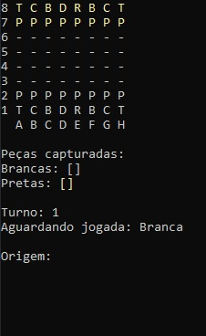

<h1 align="center"> Jogo de Xadrez </h1>

  <a href="#-tecnologias">Tecnologias</a>&nbsp;&nbsp;&nbsp;|&nbsp;&nbsp;&nbsp;
  <a href="#-layout">Layout</a>&nbsp;&nbsp;&nbsp;|&nbsp;&nbsp;&nbsp;
  <a href="#memo-licença">Licença</a>

 
Este projeto foi criado com o objetivo de praticar diversos conceitos sobre orientação a objetos, com ele tive muito aprendizado a partir dos desafios propostos durante seu desenvolvimento.

 

  

## 🚀 Tecnologias

Esse projeto foi desenvolvido com as seguintes tecnologias:

- C#
- .NET
- Git e Github

## 🔖 Layout
--------------

## :memo: Licença

Esse projeto está sob a licença MIT.
